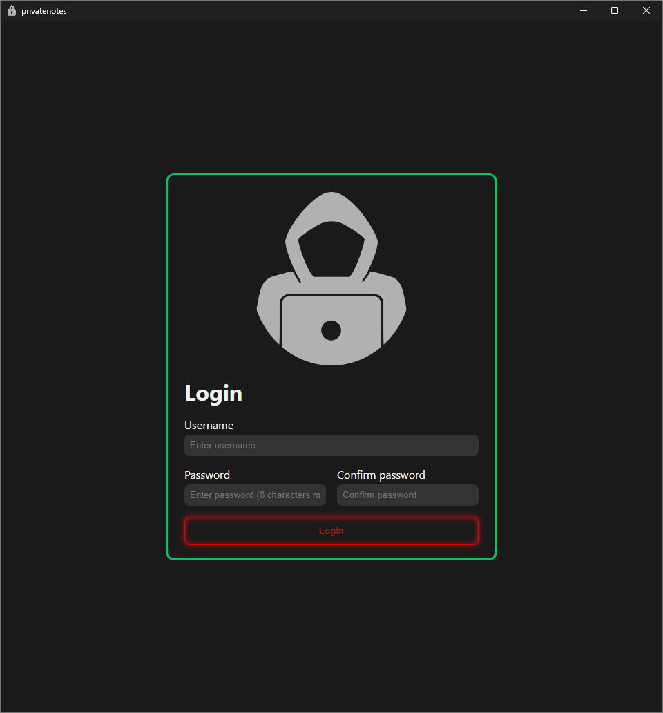
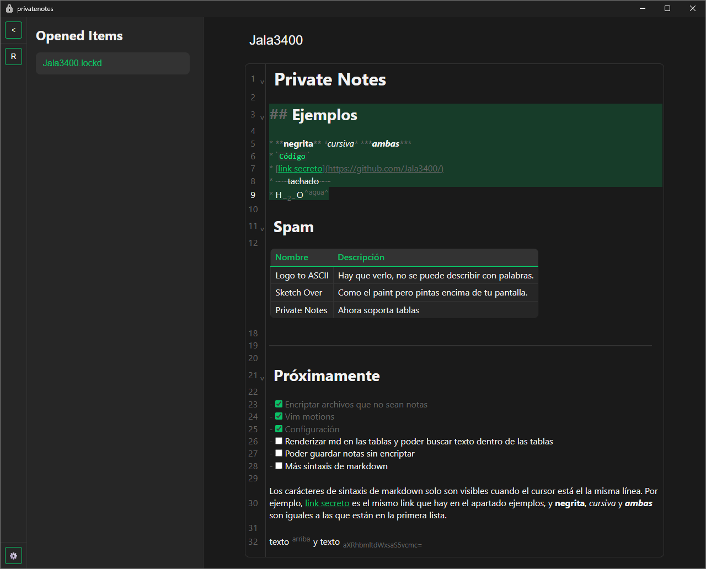

# Private Notes

Esta aplicación te permite editar y encriptar notas en formato markdown.

El proyecto está en fase temprana de desarrollo, por lo que la funcionalidad es limitada.





## Índice

- [Private Notes](#private-notes)
  - [Índice](#índice)
  - [Prerrequisitos](#prerrequisitos)
  - [Instalación](#instalación)
  - [Guía de uso](#guía-de-uso)
  - [Cómo funciona](#cómo-funciona)
  - [Tecnologías utilizadas](#tecnologías-utilizadas)

## Prerrequisitos

Antes de empezar debes de tener instalados los siguientes programas:

- [**Git**](https://git-scm.com/)
- [**Rust**](https://www.rust-lang.org/)
- [**Node.js**](https://nodejs.org/)
- [**pnpm**](https://pnpm.io/)

## Instalación

Para instalar la aplicación, sigue estos pasos:

1. Clona el repositorio:

   ```bash
   git clone https://github.com/Jala3400/PrivateNotes
   cd PrivateNotes
    ```

2. Instala las dependencias:

   ```bash
   pnpm install
   ```

3. Ejecuta la aplicación:

   ```bash
   pnpm tauri dev
   ```

## Guía de uso

Primero debes introducir un nombre de usuario y una contraseña. Si es la primera vez que usas la aplicación puedes usar cualquier nombre de usuario y contraseña, no es necesario que el usuario exista.

Aunque parezca que se está haciendo un login en realidad no se guarda ningún dato del usuario. Se necesita saber el nombre de usuario y la contraseña porque de ellos se saca la clave con la que se encriptan las notas. Se puede ver más sobre esto en [cómo funciona](#cómo-funciona).

Una vez iniciado sesión, puedes editar tus notas. Por ahora solo permite una nota a la vez. Para cargar la nota se debe arrastrar y soltar el archivo en la ventana de la aplicación.

Para guardar la nota se pulsa `ctrl + s`, lo que muestra un diálogo para guardar el archivo.

Este archivo se guarda encriptado y con la extensión `.lockd`. Esto será lo único que se guarde en el disco y solo se puede desencriptar con el login correcto.

## Cómo funciona

Para poder encriptar y desencriptar algo se necesita una contraseña. En este caso, la contraseña se genera a partir del nombre de usuario y la contraseña introducidos al iniciar sesión mediante el algoritmo Argon2id.

Argon2id es un algoritmo de hashing de contraseñas que es resistente a ataques de fuerza bruta y se utiliza para generar una clave segura a partir de la contraseña del usuario. Un algoritmo de hashing toma una entrada y produce una salida de tamaño fijo llamada hash. Esta salida es especial porque es única para cada entrada y un cambio mínimo en la entrada produce un gran cambio en la salida. Esto implica que es prácticamente imposible de invertir el proceso y obtener la contraseña original a partir del hash.

Además, se utiliza el nombre de cada usuario como sal para el algoritmo de hashing. "Sal" en un algoritmo de hashing es un parámetro adicional que cambia el resultado del hash. Esto implica que incluso si dos usuarios tienen la misma contraseña, sus hashes serán diferentes. Otra ventaja es la protección contra ataques de tablas arcoíris, que son tablas precalculadas de hashes comunes que se utilizan para romper contraseñas. Con este método cada usuario requiere un ataque diferente.

A la hora de encriptar y desencriptar las notas se utiliza el algoritmo AES (Advanced Encryption Standard). AES es un estándar de cifrado simétrico que utiliza la misma clave para encriptar y desencriptar datos. Para aumentar la seguridad, se utiliza un nonce diferente cada vez que se encripta una nota. Un nonce es un número aleatorio que se debe utilizar una sola vez por cada proceso de encriptación. Este hace que el texto cifrado sea único cada vez que se encripta, incluso si se encripta el mismo texto. Se puede hacer la prueba de encriptar varias veces la misma nota y ver que el contenido cambia cada vez. Esto es importante porque si se encripta el mismo texto varias veces con la misma clave se pueden ver patrones en el texto encriptado.

## Tecnologías utilizadas

- **Tauri**: Para crear aplicaciones de escritorio ligeras y seguras.
- **Svelte**: Para la interfaz de usuario.
- **Codemirror**: Para el editor de texto enriquecido.
- **Argon2**: Para el hashing de contraseñas.
- **AES**: Para la encriptación de notas.
