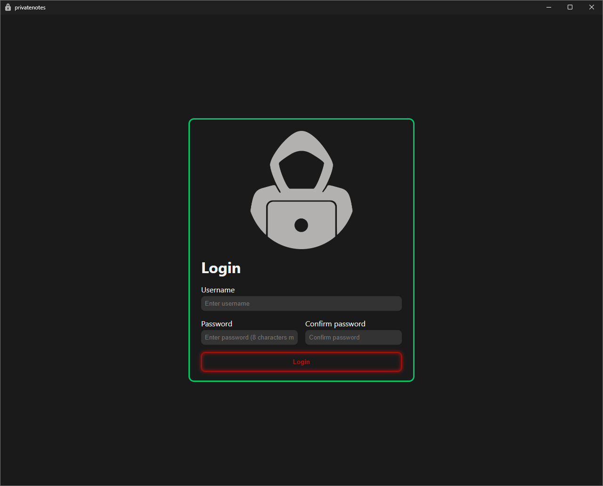

# Private Notes

Esta aplicación te permite editar y encriptar notas en formato markdown.

El proyecto está en fase temprana de desarrollo, por lo que la funcionalidad es limitada.




## Índice

- [Private Notes](#private-notes)
  - [Índice](#índice)
  - [Prerrequisitos](#prerrequisitos)
  - [Instalación](#instalación)
  - [Guía de uso](#guía-de-uso)
    - [Login](#login)
    - [Notas](#notas)
    - [Encriptar archivos](#encriptar-archivos)
  - [Cómo funciona](#cómo-funciona)
  - [Tecnologías utilizadas](#tecnologías-utilizadas)

## Prerrequisitos

Antes de empezar debes de tener instalados los siguientes programas:

- [**Git**](https://git-scm.com/)
- [**Rust**](https://www.rust-lang.org/)
- [**Node.js**](https://nodejs.org/)
- [**pnpm**](https://pnpm.io/)

## Instalación

Para instalar la aplicación, sigue estos pasos:

1. Clona el repositorio:

   ```bash
   git clone https://github.com/Jala3400/PrivateNotes
   cd PrivateNotes
    ```

2. Instala las dependencias:

   ```bash
   pnpm install
   ```

3. Ejecuta la aplicación:

   ```bash
   pnpm tauri dev
   ```

## Guía de uso

### Login

Primero debes introducir un nombre de usuario y una contraseña. Si es la primera vez que usas la aplicación puedes usar cualquier nombre de usuario y contraseña, no es necesario que el usuario exista.

Aunque parezca que se está haciendo un login, en realidad no se guarda ningún dato del usuario. Se necesita saber el nombre de usuario y la contraseña porque de ellos se saca la clave con la que se encriptan las notas. Se puede ver más sobre esto en [cómo funciona](#cómo-funciona).

Se puede reiniciar la aplicación para volver a la pantalla del login pulsando el botón en la barra lateral.

### Notas

Una vez iniciado sesión puedes editar tus notas.

Para cargar notas se arrastra un archivo `.lockd` y se abre automáticamente.

También se pueden abrir carpetas, pero estas deben tener dentro otra carpeta llamada `.lockd`.

Para guardar la nota se pulsa `ctrl + s`.
Para guardar una copia se pulsa `ctrl + g`. Después de guardar una copia se puede seguir editando la nota actual, pero la copia no se actualizará.

Cambiar el título de la nota cambia el nombre del archivo automáticamente.

### Encriptar archivos

También se pueden encriptar archivos que no sean notas con esta aplicación.

Simplemente arrastra el archivo que se quiera encriptar a la ventana de la aplicación. Se creará un archivo con el mismo nombre y extensión al que se le añadirá la extensión `.lockd`, es decir, el archivo final será `nombre.ext.lockd`. Te dejará elegir la ubicación en la que se guardará.

Para desencriptarlo se arrastra el archivo `.ext.lockd` a la ventana de la aplicación. Se te preguntará dónde quieres guardar el archivo desencriptado. El archivo desencriptado tendrá el mismo nombre y extensión que el original, es decir, `nombre.ext`.

Se diferencian de las notas porque los archivos encriptados tienen más de una extensión. Por el momento, si quieres guardar el contenido de una nota encriptada como texto plano debes cambiar el nombre del archivo a `nombre.txt.lockd` o `nombre.md.lockd` antes de arrastrarlo a la ventana de la aplicación.

Para encriptar una carpeta, se arrastra la carpeta a la ventana de la aplicación. Se creará una carpeta con el mismo nombre y extensión al que se le añadirá la extensión `.lockd`, es decir, la carpeta final será `nombre.lockd`. Se encriptarán todos los archivos dentro de esta carpeta y se guardarán con la extensión `.lockd` en la misma carpeta.

Para desencriptar una carpeta, se arrastra la carpeta `.lockd` a la ventana de la aplicación. Se te preguntará dónde quieres guardar la carpeta desencriptada. La carpeta desencriptada tendrá el mismo nombre y extensión que la original. Dentro de esta carpeta estarán los archivos desencriptados.

Se diferencia de una carpeta que puedes abrir en la aplicación porque esta carpeta no tiene dentro otra carpeta `.lockd`.

## Cómo funciona

Esta aplicación tiene como objetivo encriptar archivos de forma más segura posible. Para ello, no se guarda más información de la estrictamente necesaria, es decir, la nota encriptada.

Primero necesitamos una contraseña. En este caso se genera a partir del nombre de usuario y la contraseña introducidos al iniciar sesión mediante el algoritmo Argon2id.

Argon2id es un algoritmo de hashing de contraseñas que es resistente a ataques de fuerza bruta y se utiliza para generar una clave segura a partir de la contraseña del usuario. Un algoritmo de hashing toma una entrada y produce una salida de tamaño fijo llamada hash. Esta salida es especial porque es única para cada entrada y un cambio mínimo en la entrada produce un gran cambio en la salida. Esto implica que es prácticamente imposible de invertir el proceso y obtener la contraseña original a partir del hash.

Además, se utiliza el nombre de cada usuario como sal para el algoritmo de hashing. "Sal" en un algoritmo de hashing es un parámetro adicional que cambia el resultado del hash, por lo que incluso si dos usuarios tienen la misma contraseña sus hashes serán diferentes. Otra ventaja es la protección contra ataques de tablas arcoíris, que son tablas precalculadas de hashes comunes que se utilizan para romper contraseñas. Con este método cada usuario requiere un ataque diferente.

A la hora de encriptar y desencriptar las notas se utiliza el algoritmo AES (Advanced Encryption Standard). AES es un estándar de cifrado simétrico, es decir, que utiliza la misma clave para encriptar y desencriptar datos.

Para aumentar la seguridad, se utiliza un nonce diferente cada vez que se encripta una nota. Un nonce es un número aleatorio que se debe utilizar una sola vez por cada proceso de encriptación y que se debe guardar junto con el resultado. Este hace que el texto cifrado sea único cada vez que se encripta, incluso si se encripta el mismo texto. Se puede comprobar encriptando varias veces la misma nota y viendo que el contenido del archivo cambia. De otra forma se podrían ver patrones en el texto cifrado.

## Tecnologías utilizadas

- **Tauri**: Para crear aplicaciones de escritorio ligeras y seguras.
- **Svelte**: Para la interfaz de usuario.
- **Codemirror**: Para el editor de texto enriquecido.
- **Argon2**: Para el hashing de contraseñas.
- **AES**: Para la encriptación de notas.
